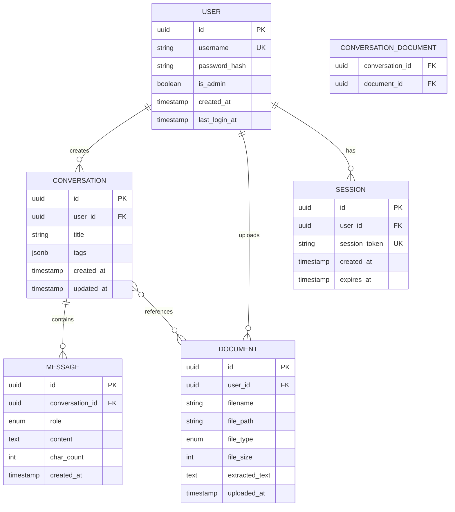

# Data Model: Local LLM Web Application

**Feature**: Local LLM Web Application for Local Government
**Date**: 2025-10-21
**Database**: PostgreSQL 15+
**ORM**: SQLAlchemy 2.0 (async)

## Overview

This document defines the database schema for the Local LLM web application. The model supports user authentication, conversation management, message storage, document uploads, and administrative functions.

---

## Entity-Relationship Diagram



---

## Entities

### 1. User

**Purpose**: Stores government employee accounts and administrators.

**Fields**:

| Field | Type | Constraints | Description |
|-------|------|-------------|-------------|
| `id` | UUID | PRIMARY KEY | Unique user identifier |
| `username` | VARCHAR(100) | UNIQUE, NOT NULL | Login username (government employee ID) |
| `password_hash` | VARCHAR(255) | NOT NULL | bcrypt-hashed password |
| `is_admin` | BOOLEAN | DEFAULT FALSE | Administrator privilege flag |
| `created_at` | TIMESTAMP | DEFAULT NOW() | Account creation timestamp |
| `last_login_at` | TIMESTAMP | NULLABLE | Last successful login time |

**Validation Rules**:
- Username: 3-100 characters, alphanumeric + hyphen/underscore
- Password (before hashing): Minimum 8 characters, at least 1 uppercase, 1 lowercase, 1 number
- Default user: `is_admin = false`

**Indexes**:
- PRIMARY KEY on `id`
- UNIQUE INDEX on `username`
- INDEX on `last_login_at` (for admin dashboard stats)

---

### 2. Conversation

**Purpose**: Groups messages into logical conversation threads for users.

**Fields**:

| Field | Type | Constraints | Description |
|-------|------|-------------|-------------|
| `id` | UUID | PRIMARY KEY | Unique conversation identifier |
| `user_id` | UUID | FOREIGN KEY(users.id), NOT NULL | Owner of conversation |
| `title` | VARCHAR(255) | DEFAULT 'New Conversation' | User-editable conversation title |
| `tags` | JSONB | NULLABLE | User-defined tags for organization (array of strings) |
| `created_at` | TIMESTAMP | DEFAULT NOW() | Conversation creation time |
| `updated_at` | TIMESTAMP | DEFAULT NOW() | Last message timestamp (auto-update on message insert) |

**Validation Rules**:
- Title: 1-255 characters
- Tags: Max 10 tags per conversation, each tag max 50 characters
- User can only access their own conversations (enforced by application)

**Indexes**:
- PRIMARY KEY on `id`
- INDEX on `(user_id, updated_at DESC)` for conversation list queries
- GIN INDEX on `tags` for tag-based filtering

**State Transitions**:
- Created → Active (on first message)
- Active → Archived (user can archive, future enhancement)
- Deleted (soft delete with `deleted_at` timestamp, future enhancement)

---

### 3. Message

**Purpose**: Individual query or response within a conversation.

**Fields**:

| Field | Type | Constraints | Description |
|-------|------|-------------|-------------|
| `id` | UUID | PRIMARY KEY | Unique message identifier |
| `conversation_id` | UUID | FOREIGN KEY(conversations.id) ON DELETE CASCADE, NOT NULL | Parent conversation |
| `role` | ENUM('user', 'assistant') | NOT NULL | Message sender (user query or LLM response) |
| `content` | TEXT | NOT NULL | Message text content |
| `char_count` | INTEGER | NOT NULL | Character count (for 4,000 limit enforcement) |
| `created_at` | TIMESTAMP | DEFAULT NOW() | Message timestamp |

**Validation Rules**:
- Role: Must be 'user' or 'assistant'
- Content: Max 10,000 characters (user queries unrestricted, LLM responses limited to 4,000 by application)
- char_count: Auto-calculated on insert (excludes whitespace)

**Indexes**:
- PRIMARY KEY on `id`
- INDEX on `(conversation_id, created_at ASC)` for chronological message retrieval

**Triggers**:
- ON INSERT: Update `conversations.updated_at` to current timestamp

---

### 4. Document

**Purpose**: Metadata for uploaded documents (PDF, TXT, DOCX).

**Fields**:

| Field | Type | Constraints | Description |
|-------|------|-------------|-------------|
| `id` | UUID | PRIMARY KEY | Unique document identifier |
| `user_id` | UUID | FOREIGN KEY(users.id), NOT NULL | Document owner |
| `filename` | VARCHAR(255) | NOT NULL | Original filename |
| `file_path` | VARCHAR(500) | UNIQUE, NOT NULL | Path on server filesystem |
| `file_type` | ENUM('pdf', 'txt', 'docx') | NOT NULL | Document type |
| `file_size` | INTEGER | NOT NULL | File size in bytes (max 50MB = 52,428,800 bytes) |
| `extracted_text` | TEXT | NULLABLE | Extracted text content (for search/Q&A) |
| `uploaded_at` | TIMESTAMP | DEFAULT NOW() | Upload timestamp |

**Validation Rules**:
- filename: 1-255 characters, sanitized (remove path traversal characters)
- file_path: Unique server path (e.g., `/uploads/{user_id}/{doc_id}.{ext}`)
- file_size: Max 52,428,800 bytes (50MB)
- file_type: Validated by magic number, not extension

**Indexes**:
- PRIMARY KEY on `id`
- INDEX on `(user_id, uploaded_at DESC)` for user's document list
- FULLTEXT INDEX on `extracted_text` using PostgreSQL `to_tsvector` (for Korean text search)

**Cascade Behavior**:
- ON DELETE user: Set `user_id` to NULL (orphan documents, or CASCADE delete)
- Filesystem cleanup: Application deletes file at `file_path` when document deleted

---

### 5. Conversation_Document (Join Table)

**Purpose**: Many-to-many relationship between conversations and documents.

**Fields**:

| Field | Type | Constraints | Description |
|-------|------|-------------|-------------|
| `conversation_id` | UUID | FOREIGN KEY(conversations.id) ON DELETE CASCADE | Conversation using document |
| `document_id` | UUID | FOREIGN KEY(documents.id) ON DELETE CASCADE | Document used in conversation |

**Composite Primary Key**: (`conversation_id`, `document_id`)

**Use Case**: User uploads document, then references it in multiple conversations or references multiple documents in one conversation.

**Indexes**:
- COMPOSITE PRIMARY KEY on `(conversation_id, document_id)`
- INDEX on `document_id` for reverse lookups ("which conversations use this doc?")

---

### 6. Session

**Purpose**: Tracks active user sessions for authentication.

**Fields**:

| Field | Type | Constraints | Description |
|-------|------|-------------|-------------|
| `id` | UUID | PRIMARY KEY | Unique session identifier |
| `user_id` | UUID | FOREIGN KEY(users.id) ON DELETE CASCADE, NOT NULL | Authenticated user |
| `session_token` | VARCHAR(255) | UNIQUE, NOT NULL | Random session token (stored in HTTP-only cookie) |
| `created_at` | TIMESTAMP | DEFAULT NOW() | Session creation time |
| `expires_at` | TIMESTAMP | NOT NULL | Session expiration (30 minutes from last activity) |

**Validation Rules**:
- session_token: Cryptographically secure random string (64 characters, hex)
- expires_at: Auto-set to 30 minutes from `created_at`, refreshed on each request

**Indexes**:
- PRIMARY KEY on `id`
- UNIQUE INDEX on `session_token` (for fast lookup on each request)
- INDEX on `(user_id, expires_at DESC)` (for cleaning expired sessions)

**Lifecycle**:
- Created on successful login
- Extended (+30 min) on each authenticated request
- Deleted on logout or expiration (background job cleans expired every hour)

---

## Data Volumes & Storage Estimates

**Assumptions**:
- 50 users
- Average 100 conversations per user per year
- Average 20 messages per conversation
- Average 500 characters per message
- 20 documents per user per year
- Average 10MB per document

**Annual Storage**:

| Entity | Count | Size per Row | Total Size |
|--------|-------|--------------|------------|
| User | 50 | 500 bytes | 25 KB |
| Conversation | 5,000 | 1 KB | 5 MB |
| Message | 100,000 | 1 KB | 100 MB |
| Document (metadata) | 1,000 | 2 KB | 2 MB |
| Document (files) | 1,000 | 10 MB | 10 GB |
| Session | 50 (concurrent) | 500 bytes | 25 KB |

**Total**: ~10.1 GB per year (mostly document files)

**Scaling**: With indefinite retention, 5 years = ~50GB. PostgreSQL can handle this comfortably on standard server hardware.

---

## Query Patterns

### High-Frequency Queries

1. **Get user's conversation list** (paginated):
```sql
SELECT id, title, tags, updated_at
FROM conversations
WHERE user_id = ?
ORDER BY updated_at DESC
LIMIT 20 OFFSET ?;
```

2. **Get messages for conversation**:
```sql
SELECT id, role, content, created_at
FROM messages
WHERE conversation_id = ?
ORDER BY created_at ASC;
```

3. **Validate session**:
```sql
SELECT user_id, expires_at
FROM sessions
WHERE session_token = ? AND expires_at > NOW();
```

4. **Search conversations by keyword**:
```sql
SELECT c.id, c.title, c.updated_at
FROM conversations c
JOIN messages m ON c.id = m.conversation_id
WHERE c.user_id = ? AND m.content ILIKE '%?%'
GROUP BY c.id
ORDER BY c.updated_at DESC;
```

### Admin Queries

5. **Count active users (last 30 days)**:
```sql
SELECT COUNT(DISTINCT user_id)
FROM sessions
WHERE created_at > NOW() - INTERVAL '30 days';
```

6. **Total queries processed (today/week/month)**:
```sql
SELECT COUNT(*)
FROM messages
WHERE role = 'user' AND created_at > ?;
```

7. **Storage usage per user**:
```sql
SELECT user_id, SUM(file_size) as total_bytes
FROM documents
GROUP BY user_id
ORDER BY total_bytes DESC;
```

---

## Database Migrations

**Tool**: Alembic (SQLAlchemy's migration tool)

**Initial Migration** (v0.1.0):
- Create all tables with indexes
- Create ENUM types (role, file_type)
- Set up foreign key constraints
- Add trigger for `conversations.updated_at`

**Future Migrations** (examples):
- Add `conversations.deleted_at` for soft deletes
- Add `users.ldap_id` for AD integration
- Add `messages.metadata` JSONB for streaming stats
- Partition `messages` table if >10M rows

**Migration Process** (air-gap):
1. Test migration on dev database (with internet)
2. Export migration script as SQL file
3. Transfer to air-gapped server
4. Apply via `alembic upgrade head` (or manual SQL if needed)

---

## Data Retention & Cleanup

**Current Policy** (from spec):
- **Indefinite retention** until user manually deletes
- No automatic cleanup

**Future Enhancements**:
- Admin-configurable retention policy (e.g., auto-delete after 365 days)
- Soft deletes with grace period (30 days to recover)
- Anonymize old conversations (delete content, keep metadata for stats)

**Cleanup Jobs** (cron or scheduled task):
- Expired sessions: Delete where `expires_at < NOW() - INTERVAL '24 hours'` (daily)
- Orphaned documents: Delete files with no DB record (weekly)

---

## Security Considerations

1. **Row-Level Security** (optional, Phase 2):
   - PostgreSQL RLS policies to enforce `user_id` filtering at DB level
   - Prevents accidental cross-user data leaks in application bugs

2. **Sensitive Data**:
   - Passwords: Hashed with bcrypt (never store plaintext)
   - Session tokens: Random, unguessable (cryptographically secure)
   - Documents: File permissions (chmod 600) readable only by app user

3. **SQL Injection Prevention**:
   - Use SQLAlchemy ORM (parameterized queries)
   - Never concatenate user input into SQL strings

4. **Audit Logging** (Phase 2):
   - Separate `audit_log` table for tracking admin actions
   - Fields: `user_id`, `action`, `target_id`, `timestamp`, `ip_address`

---

## Performance Optimization

**Indexes** (already defined above):
- All foreign keys indexed
- Composite indexes for common queries
- Full-text index on `messages.content` and `documents.extracted_text`

**Connection Pooling**:
- SQLAlchemy connection pool: 20-40 connections
- PostgreSQL max_connections: 100

**Query Optimization**:
- Paginate conversation/message lists (LIMIT/OFFSET)
- Lazy-load message content (only fetch IDs for list views)
- Use `SELECT DISTINCT` sparingly (expensive)

**Future Optimizations** (if needed):
- Materialized view for admin dashboard stats
- Partition `messages` table by `created_at` (monthly partitions)
- Redis cache for session validation (avoid DB hit on every request)

---

## Data Model Summary

**6 core entities**: User, Conversation, Message, Document, Conversation_Document, Session

**Key Design Decisions**:
1. **UUIDs**: Better for distributed systems, no sequential ID leakage
2. **JSONB for tags**: Flexible, indexed for fast queries
3. **CASCADE deletes**: Automatic cleanup of related data
4. **Full-text search**: PostgreSQL native (no Elasticsearch needed)
5. **Session table**: DB-backed sessions (simple, no Redis for 50 users)

**Ready for Phase 1: API Contracts**.
