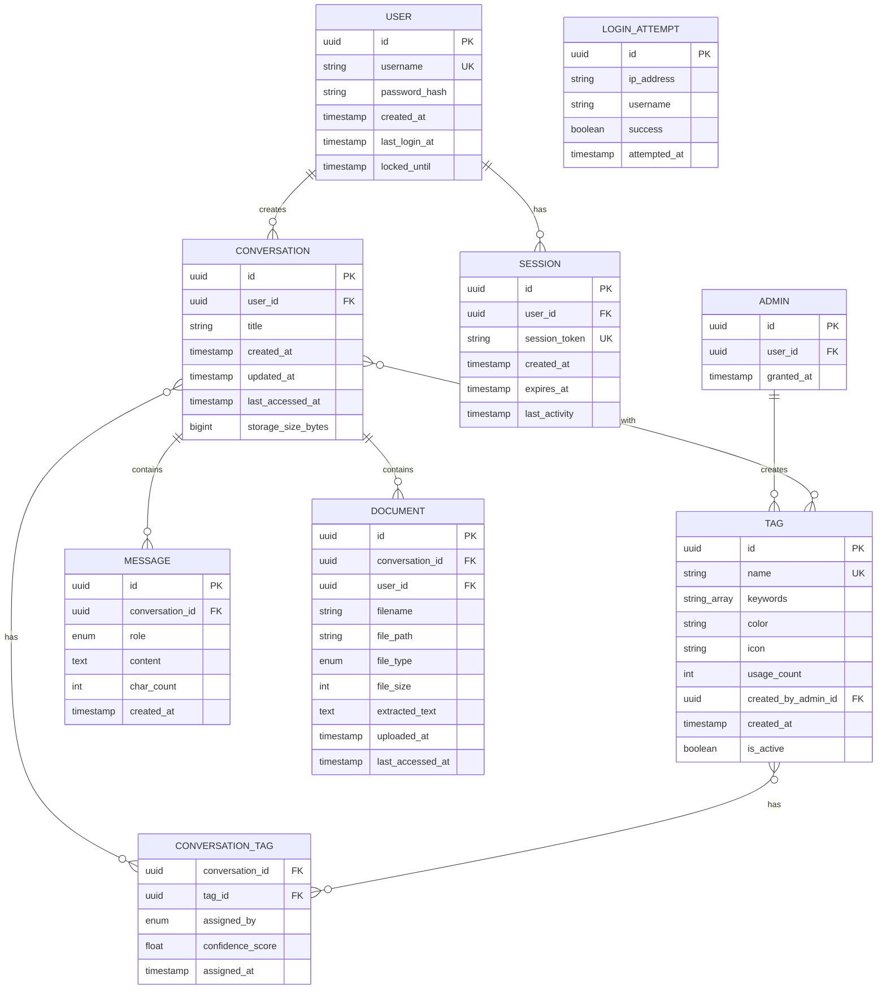

# Data Model: Local LLM Web Application

**Feature**: Local LLM Web Application for Local Government
**Date**: 2025-10-21
**Database**: PostgreSQL 15+
**ORM**: SQLAlchemy 2.0 (async)

## Overview

This document defines the database schema for the Local LLM web application. The model supports user authentication, conversation management, message storage, document uploads, and administrative functions.

---

## Entity-Relationship Diagram



---

## Entities

### 1. User

**Purpose**: Stores government employee accounts (administrators managed separately in Admin table per FR-033).

**Fields**:

| Field | Type | Constraints | Description |
|-------|------|-------------|-------------|
| `id` | UUID | PRIMARY KEY | Unique user identifier |
| `username` | VARCHAR(100) | UNIQUE, NOT NULL | Login username (government employee ID) |
| `password_hash` | VARCHAR(255) | NOT NULL | bcrypt-hashed password (cost factor 12, FR-029) |
| `created_at` | TIMESTAMP | DEFAULT NOW() | Account creation timestamp |
| `last_login_at` | TIMESTAMP | NULLABLE | Last successful login time |
| `locked_until` | TIMESTAMP | NULLABLE | Account lockout expiration (FR-031) |

**Validation Rules**:
- Username: 3-100 characters, alphanumeric + hyphen/underscore
- Password (before hashing): Minimum 8 characters, at least 2 types among letters/numbers/special characters (FR-029)
- locked_until: Set to NOW() + 30 minutes after 5 failed login attempts

**Indexes**:
- PRIMARY KEY on `id`
- UNIQUE INDEX on `username`
- INDEX on `last_login_at` (for admin dashboard stats)
- INDEX on `locked_until` (for cleanup job)

---

### 2. Conversation

**Purpose**: Groups messages into logical conversation threads for users.

**Fields**:

| Field | Type | Constraints | Description |
|-------|------|-------------|-------------|
| `id` | UUID | PRIMARY KEY | Unique conversation identifier |
| `user_id` | UUID | FOREIGN KEY(users.id), NOT NULL | Owner of conversation |
| `title` | VARCHAR(255) | DEFAULT 'New Conversation' | User-editable conversation title |
| `created_at` | TIMESTAMP | DEFAULT NOW() | Conversation creation time |
| `updated_at` | TIMESTAMP | DEFAULT NOW() | Last message timestamp (auto-update on message insert) |
| `last_accessed_at` | TIMESTAMP | DEFAULT NOW() | Last access timestamp (for auto-cleanup, Clarification 2025-10-28) |
| `storage_size_bytes` | BIGINT | DEFAULT 0 | Total storage used by conversation + documents (for quota enforcement, Clarification 2025-10-28) |

**Validation Rules**:
- Title: 1-255 characters
- User can only access their own conversations (enforced by application and middleware, FR-032)
- Max 1,000 messages per conversation (FR-041)

**Indexes**:
- PRIMARY KEY on `id`
- INDEX on `(user_id, updated_at DESC)` for conversation list queries
- INDEX on `(user_id, last_accessed_at)` for auto-cleanup job (Clarification 2025-10-28)

**Note**: Tags moved to separate Tag and ConversationTag tables (FR-043)

**State Transitions**:
- Created → Active (on first message)
- Active → Archived (user can archive, future enhancement)
- Deleted (soft delete with `deleted_at` timestamp, future enhancement)

**Auto-Cleanup (Clarification 2025-10-28)**:
- When user storage reaches 10GB limit, oldest conversations (by last_accessed_at) inactive for 30+ days are auto-deleted
- storage_size_bytes tracks total size: sum of message content + uploaded documents
- last_accessed_at updated on: conversation open, message sent, document accessed

---

### 3. Message

**Purpose**: Individual query or response within a conversation.

**Fields**:

| Field | Type | Constraints | Description |
|-------|------|-------------|-------------|
| `id` | UUID | PRIMARY KEY | Unique message identifier |
| `conversation_id` | UUID | FOREIGN KEY(conversations.id) ON DELETE CASCADE, NOT NULL | Parent conversation |
| `role` | ENUM('user', 'assistant') | NOT NULL | Message sender (user query or LLM response) |
| `content` | TEXT | NOT NULL | Message text content |
| `char_count` | INTEGER | NOT NULL | Character count (for 4,000 limit enforcement) |
| `created_at` | TIMESTAMP | DEFAULT NOW() | Message timestamp |

**Validation Rules**:
- Role: Must be 'user' or 'assistant'
- Content: Max 10,000 characters (user queries unrestricted, LLM responses limited to 4,000 by application)
- char_count: Auto-calculated on insert (excludes whitespace)

**Indexes**:
- PRIMARY KEY on `id`
- INDEX on `(conversation_id, created_at ASC)` for chronological message retrieval

**Triggers**:
- ON INSERT: Update `conversations.updated_at` to current timestamp

---

### 4. Document

**Purpose**: Metadata for uploaded documents (PDF, TXT, DOCX). **IMPORTANT**: Documents are scoped to individual conversations (Clarification 2025-10-28), not shared across conversations.

**Fields**:

| Field | Type | Constraints | Description |
|-------|------|-------------|-------------|
| `id` | UUID | PRIMARY KEY | Unique document identifier |
| `conversation_id` | UUID | FOREIGN KEY(conversations.id) ON DELETE CASCADE, NOT NULL | Parent conversation (documents belong to one conversation) |
| `user_id` | UUID | FOREIGN KEY(users.id), NOT NULL | Document owner (redundant for isolation checks) |
| `filename` | VARCHAR(255) | NOT NULL | Original filename |
| `file_path` | VARCHAR(500) | UNIQUE, NOT NULL | Path on server filesystem |
| `file_type` | ENUM('pdf', 'txt', 'docx') | NOT NULL | Document type |
| `file_size` | INTEGER | NOT NULL | File size in bytes (max 50MB = 52,428,800 bytes) |
| `extracted_text` | TEXT | NULLABLE | Extracted text content (for search/Q&A) |
| `uploaded_at` | TIMESTAMP | DEFAULT NOW() | Upload timestamp |
| `last_accessed_at` | TIMESTAMP | DEFAULT NOW() | Last access timestamp (for auto-cleanup, Clarification 2025-10-28) |

**Validation Rules**:
- filename: 1-255 characters, sanitized (remove path traversal characters)
- file_path: Unique server path (e.g., `/uploads/{user_id}/{conversation_id}/{doc_id}.{ext}`)
- file_size: Max 52,428,800 bytes (50MB)
- file_type: Validated by magic number, not extension

**Indexes**:
- PRIMARY KEY on `id`
- INDEX on `(conversation_id, uploaded_at DESC)` for conversation's document list
- INDEX on `(user_id, last_accessed_at)` for auto-cleanup job (Clarification 2025-10-28)
- FULLTEXT INDEX on `extracted_text` using PostgreSQL `to_tsvector` (for Korean text search)

**Cascade Behavior**:
- ON DELETE conversation: CASCADE delete (documents deleted when parent conversation deleted)
- Filesystem cleanup: Application deletes file at `file_path` when document deleted

**Scope Change (Clarification 2025-10-28)**:
- Documents are **conversation-scoped**, not user-scoped
- Uploaded to specific conversation, accessible only within that conversation
- Multi-document comparison only within same conversation (FR-009)
- Automatically deleted when parent conversation is deleted

---

### 5. ~~Conversation_Document (Join Table)~~ **REMOVED**

**Change**: Removed join table since documents are now 1:N with conversations (conversation_id foreign key in Document table), not M:N.

**Rationale**: Clarification 2025-10-28 specified documents belong to individual conversations, simplifying data model.

---

### 6. Session

**Purpose**: Tracks active user sessions for authentication (supports concurrent logins per FR-030).

**Fields**:

| Field | Type | Constraints | Description |
|-------|------|-------------|-------------|
| `id` | UUID | PRIMARY KEY | Unique session identifier |
| `user_id` | UUID | FOREIGN KEY(users.id) ON DELETE CASCADE, NOT NULL | Authenticated user |
| `session_token` | VARCHAR(255) | UNIQUE, NOT NULL | Random session token (stored in HTTP-only cookie) |
| `created_at` | TIMESTAMP | DEFAULT NOW() | Session creation time |
| `last_activity` | TIMESTAMP | DEFAULT NOW() | Last user request timestamp (for timeout calculation) |
| `expires_at` | TIMESTAMP | NOT NULL | Session expiration (30 minutes from last_activity, FR-012) |

**Validation Rules**:
- session_token: Cryptographically secure random string (64 characters, hex)
- expires_at: Auto-updated to `last_activity + 30 minutes` on each request
- Maximum 3 concurrent sessions per user (FR-030): Delete oldest session when limit exceeded

**Indexes**:
- PRIMARY KEY on `id`
- UNIQUE INDEX on `session_token` (for fast lookup on each request)
- INDEX on `(user_id, last_activity DESC)` (for concurrent session limit enforcement)
- INDEX on `expires_at` (for cleanup job)

**Lifecycle**:
- Created on successful login (limit 3 per user)
- last_activity updated on each authenticated request
- expires_at recalculated: `last_activity + 30 minutes`
- Deleted on logout, expiration, or forced logout (background job cleans expired hourly)

---

### 7. Admin

**Purpose**: Separate administrator privilege management (prevents privilege escalation per FR-033).

**Fields**:

| Field | Type | Constraints | Description |
|-------|------|-------------|-------------|
| `id` | UUID | PRIMARY KEY | Unique admin record identifier |
| `user_id` | UUID | FOREIGN KEY(users.id) ON DELETE CASCADE, UNIQUE, NOT NULL | User with admin privileges |
| `granted_at` | TIMESTAMP | DEFAULT NOW() | When admin privilege was granted |
| `granted_by_admin_id` | UUID | FOREIGN KEY(admins.id), NULLABLE | Admin who granted privilege (NULL for initial admin) |

**Validation Rules**:
- Only one admin record per user_id (UNIQUE constraint)
- Administrators cannot remove own admin privileges (enforced in application logic)

**Indexes**:
- PRIMARY KEY on `id`
- UNIQUE INDEX on `user_id` (for admin check on each privileged operation)

**Rationale**:
- Separate table prevents accidental privilege grants via is_admin flag manipulation
- Admin privilege grants require direct database access or secure administrative tool (FR-033)

---

### 8. Tag

**Purpose**: Organization-wide tags for conversation categorization, created by administrators (FR-043).

**Fields**:

| Field | Type | Constraints | Description |
|-------|------|-------------|-------------|
| `id` | UUID | PRIMARY KEY | Unique tag identifier |
| `name` | VARCHAR(50) | UNIQUE, NOT NULL | Tag display name (e.g., "인사", "회계") |
| `keywords` | TEXT[] | NULLABLE | Optional keywords for semantic matching (e.g., ["HR", "직원", "채용"]) |
| `color` | VARCHAR(7) | NOT NULL | Hex color code for UI display (e.g., "#FF5733") |
| `icon` | VARCHAR(50) | NULLABLE | Icon name for UI (e.g., "user-group") |
| `usage_count` | INTEGER | DEFAULT 0 | Number of conversations using this tag |
| `created_by_admin_id` | UUID | FOREIGN KEY(admins.id), NOT NULL | Admin who created tag |
| `created_at` | TIMESTAMP | DEFAULT NOW() | Tag creation timestamp |
| `is_active` | BOOLEAN | DEFAULT TRUE | Soft delete flag (inactive tags hidden from auto-matching) |

**Validation Rules**:
- name: 1-50 characters, unique across organization
- keywords: Max 10 keywords per tag, each max 50 characters
- color: Valid hex color code (#RRGGBB format)
- Cannot delete tag if usage_count > 0 (enforced with confirmation in API)

**Indexes**:
- PRIMARY KEY on `id`
- UNIQUE INDEX on `name`
- INDEX on `is_active` (for filtering active tags)
- INDEX on `usage_count DESC` (for popular tags list)

**Lifecycle**:
- Created by administrator through tag management UI
- usage_count incremented/decremented on tag assignment/removal
- is_active set to FALSE for soft delete (preserves historical tag assignments)

---

### 9. ConversationTag (Join Table)

**Purpose**: Many-to-many relationship between conversations and tags with metadata (FR-043).

**Fields**:

| Field | Type | Constraints | Description |
|-------|------|-------------|-------------|
| `conversation_id` | UUID | FOREIGN KEY(conversations.id) ON DELETE CASCADE, NOT NULL | Tagged conversation |
| `tag_id` | UUID | FOREIGN KEY(tags.id) ON DELETE RESTRICT, NOT NULL | Assigned tag |
| `assigned_by` | ENUM('system', 'user') | DEFAULT 'system' | Assignment source (auto vs manual) |
| `confidence_score` | FLOAT | NULLABLE | Semantic similarity score (0.0-1.0) for system-assigned tags |
| `assigned_at` | TIMESTAMP | DEFAULT NOW() | Tag assignment timestamp |

**Composite Primary Key**: (`conversation_id`, `tag_id`)

**Validation Rules**:
- Max 5 tags per conversation (enforced in application)
- confidence_score: Only set for system-assigned tags, NULL for manual assignments
- ON DELETE RESTRICT for tag_id: Prevent tag deletion if in use (must manually remove first)

**Indexes**:
- COMPOSITE PRIMARY KEY on `(conversation_id, tag_id)`
- INDEX on `tag_id` (for "conversations with this tag" queries)
- INDEX on `assigned_by` (for filtering auto-assigned vs manual tags)

**Use Case**:
- System auto-assigns tags based on conversation content (embedding similarity)
- Users can manually add/remove tags to override or supplement auto-assignments
- Confidence score helps users understand auto-assignment quality

---

### 10. LoginAttempt

**Purpose**: Track login attempts for account lockout and rate limiting (FR-031).

**Fields**:

| Field | Type | Constraints | Description |
|-------|------|-------------|-------------|
| `id` | UUID | PRIMARY KEY | Unique attempt identifier |
| `ip_address` | VARCHAR(45) | NOT NULL | Client IP address (supports IPv6) |
| `username` | VARCHAR(100) | NOT NULL | Attempted username (may not exist) |
| `success` | BOOLEAN | NOT NULL | Login success/failure |
| `attempted_at` | TIMESTAMP | DEFAULT NOW() | Attempt timestamp |
| `user_agent` | TEXT | NULLABLE | Browser user agent string |

**Validation Rules**:
- ip_address: Valid IPv4 or IPv6 format
- Cleanup: Delete records older than 7 days (background job)

**Indexes**:
- PRIMARY KEY on `id`
- INDEX on `(username, attempted_at DESC)` (for counting recent failed attempts)
- INDEX on `(ip_address, attempted_at DESC)` (for IP rate limiting)
- INDEX on `attempted_at` (for cleanup job)

**Use Case**:
- **Account lockout**: Count failed attempts for username in last 30 minutes → lock if >= 5
- **IP rate limiting**: Count attempts from IP in last 1 minute → block if >= 10
- **Audit log**: Track all login activity for security review

**Cleanup Policy**:
- Delete records older than 7 days (daily cleanup job)
- Retention sufficient for 30-minute account lockout and rate limiting

---

## Data Volumes & Storage Estimates

**Assumptions**:
- 50 users
- Average 100 conversations per user per year
- Average 20 messages per conversation
- Average 500 characters per message
- 20 documents per user per year
- Average 10MB per document

**Annual Storage**:

| Entity | Count | Size per Row | Total Size |
|--------|-------|--------------|------------|
| User | 50 | 500 bytes | 25 KB |
| Conversation | 5,000 | 1 KB | 5 MB |
| Message | 100,000 | 1 KB | 100 MB |
| Document (metadata) | 1,000 | 2 KB | 2 MB |
| Document (files) | 1,000 | 10 MB | 10 GB |
| Session | 50 (concurrent) | 500 bytes | 25 KB |

**Total**: ~10.1 GB per year (mostly document files)

**Scaling**: With indefinite retention, 5 years = ~50GB. PostgreSQL can handle this comfortably on standard server hardware.

---

## Query Patterns

### High-Frequency Queries

1. **Get user's conversation list** (paginated):
```sql
SELECT id, title, tags, updated_at
FROM conversations
WHERE user_id = ?
ORDER BY updated_at DESC
LIMIT 20 OFFSET ?;
```

2. **Get messages for conversation**:
```sql
SELECT id, role, content, created_at
FROM messages
WHERE conversation_id = ?
ORDER BY created_at ASC;
```

3. **Validate session**:
```sql
SELECT user_id, expires_at
FROM sessions
WHERE session_token = ? AND expires_at > NOW();
```

4. **Search conversations by keyword**:
```sql
SELECT c.id, c.title, c.updated_at
FROM conversations c
JOIN messages m ON c.id = m.conversation_id
WHERE c.user_id = ? AND m.content ILIKE '%?%'
GROUP BY c.id
ORDER BY c.updated_at DESC;
```

### Admin Queries

5. **Count active users (last 30 days)**:
```sql
SELECT COUNT(DISTINCT user_id)
FROM sessions
WHERE created_at > NOW() - INTERVAL '30 days';
```

6. **Total queries processed (today/week/month)**:
```sql
SELECT COUNT(*)
FROM messages
WHERE role = 'user' AND created_at > ?;
```

7. **Storage usage per user**:
```sql
SELECT user_id, SUM(file_size) as total_bytes
FROM documents
GROUP BY user_id
ORDER BY total_bytes DESC;
```

---

## Database Migrations

**Tool**: Alembic (SQLAlchemy's migration tool)

**Initial Migration** (v0.1.0):
- Create all tables with indexes
- Create ENUM types (role, file_type)
- Set up foreign key constraints
- Add trigger for `conversations.updated_at`

**Future Migrations** (examples):
- Add `conversations.deleted_at` for soft deletes
- Add `users.ldap_id` for AD integration
- Add `messages.metadata` JSONB for streaming stats
- Partition `messages` table if >10M rows

**Migration Process** (air-gap):
1. Test migration on dev database (with internet)
2. Export migration script as SQL file
3. Transfer to air-gapped server
4. Apply via `alembic upgrade head` (or manual SQL if needed)

---

## Data Retention & Cleanup

**Current Policy** (from spec):
- **Indefinite retention** until user manually deletes
- No automatic cleanup

**Future Enhancements**:
- Admin-configurable retention policy (e.g., auto-delete after 365 days)
- Soft deletes with grace period (30 days to recover)
- Anonymize old conversations (delete content, keep metadata for stats)

**Cleanup Jobs** (cron or scheduled task):
- Expired sessions: Delete where `expires_at < NOW() - INTERVAL '24 hours'` (daily)
- Orphaned documents: Delete files with no DB record (weekly)

---

## Security Considerations

1. **Row-Level Security** (optional, Phase 2):
   - PostgreSQL RLS policies to enforce `user_id` filtering at DB level
   - Prevents accidental cross-user data leaks in application bugs

2. **Sensitive Data**:
   - Passwords: Hashed with bcrypt (never store plaintext)
   - Session tokens: Random, unguessable (cryptographically secure)
   - Documents: File permissions (chmod 600) readable only by app user

3. **SQL Injection Prevention**:
   - Use SQLAlchemy ORM (parameterized queries)
   - Never concatenate user input into SQL strings

4. **Audit Logging** (Phase 2):
   - Separate `audit_log` table for tracking admin actions
   - Fields: `user_id`, `action`, `target_id`, `timestamp`, `ip_address`

---

## Performance Optimization

**Indexes** (already defined above):
- All foreign keys indexed
- Composite indexes for common queries
- Full-text index on `messages.content` and `documents.extracted_text`

**Connection Pooling**:
- SQLAlchemy connection pool: 20-40 connections
- PostgreSQL max_connections: 100

**Query Optimization**:
- Paginate conversation/message lists (LIMIT/OFFSET)
- Lazy-load message content (only fetch IDs for list views)
- Use `SELECT DISTINCT` sparingly (expensive)

**Future Optimizations** (if needed):
- Materialized view for admin dashboard stats
- Partition `messages` table by `created_at` (monthly partitions)
- Redis cache for session validation (avoid DB hit on every request)

---

---

## Backup Considerations (FR-042)

**Database Backup Strategy**:
```bash
# Daily incremental backup (2 AM)
pg_dump -U postgres -F c -d llm_webapp -f /backup/daily/db_$(date +%Y%m%d).dump

# Weekly full backup (Sunday 2 AM)
pg_dump -U postgres -F c -b -v -f /backup/weekly/db_$(date +%Y%m%d).tar.gz llm_webapp
```

**Document Backup Strategy**:
```bash
# Incremental backup with hard links (space-efficient)
rsync -a --link-dest=../$(date -d "1 day ago" +%Y%m%d) \
  /var/lib/llm-webapp/uploads \
  /backup/daily/uploads_$(date +%Y%m%d)
```

**Backup Retention**:
- Daily backups: 30 days (auto-cleanup)
- Weekly backups: 12 weeks (3 months)
- Total storage requirement: ~1TB

**Critical Tables for Backup**:
1. **users** - Account credentials
2. **conversations** + **messages** - User data (primary asset)
3. **documents** - Metadata for uploaded files
4. **tags** + **conversation_tags** - Organization data
5. **admins** - Administrator privilege records

**Restore Priority** (in case of partial restore):
1. users, admins (authentication)
2. conversations, messages (user work)
3. documents (file metadata + files)
4. tags, conversation_tags (organization)
5. sessions, login_attempts (can be regenerated)

**Backup Verification**:
- Weekly automated restore test to /tmp/restore_test
- Compare row counts: production vs restored database
- Alert on backup failures via log monitoring

---

## Data Model Summary

**10 core entities**: User, Conversation, Message, Document, Conversation_Document, Session, Admin, Tag, ConversationTag, LoginAttempt

**Key Design Decisions**:
1. **UUIDs**: Better for distributed systems, no sequential ID leakage
2. **Separate Admin table**: Prevents privilege escalation (FR-033)
3. **Tag normalization**: Separate Tag entity with M:N relationship (FR-043) instead of JSONB
4. **CASCADE deletes**: Automatic cleanup of related data (conversations → messages)
5. **RESTRICT deletes**: Prevent tag deletion if in use (tags → conversation_tags)
6. **Full-text search**: PostgreSQL native (no Elasticsearch needed)
7. **Session table**: DB-backed sessions (simple, no Redis for 50 users)
8. **LoginAttempt tracking**: Enables account lockout and IP rate limiting (FR-031)

**New Requirements Addressed**:
- FR-029: Password complexity (enforced in application, hashed with bcrypt cost 12)
- FR-030: Concurrent sessions (max 3 per user via Session table)
- FR-031: Login protection (LoginAttempt table tracks failures)
- FR-032: Data isolation (enforced via middleware, user_id filtering)
- FR-033: Privilege escalation prevention (Admin table instead of is_admin flag)
- FR-042: Backup strategy (pg_dump + rsync, 30-day retention)
- FR-043: Tag auto-matching (Tag + ConversationTag tables with confidence scoring)

**Ready for Phase 1: API Contracts**.
